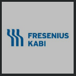

## Fresenius Kabi
- *Software Engineer* | Aug'22 - Currently
- 
- Tags: Category 1
- Badges:
  - Badge [blue]
- List Items:
  - Development, validation and management of the Laboratory Information Management System at Fresenius Kabi
  - Developing microservices to interface with laboratory instruments
  - Project management

## A3P Biomedical
- *Software Developer* | Oct'20 - Aug'22
- 
- Tags: Category 2
- Badges:
  - Badge [blue]
- List Items:
  - Management and development A3P Biomedical's Laboratory Information Management System (LIMS) and related software applications, which involved software development, project management, IT validation and accreditation, while closely collaborating with the laboratory to understand lab machines and assays.

## Self-employed
- *Software developer* | Jan'22 - Currently
- 
- Tags: Category 3
- Badges:
  - Badge [blue]
- List Items:
  - Providing consulting and freelance software development solutions across industries
