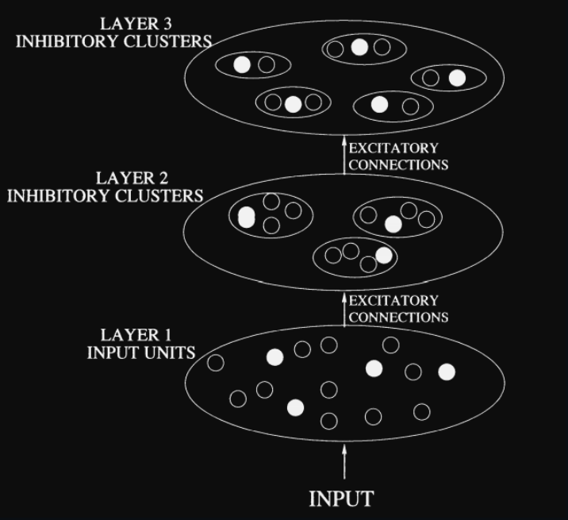
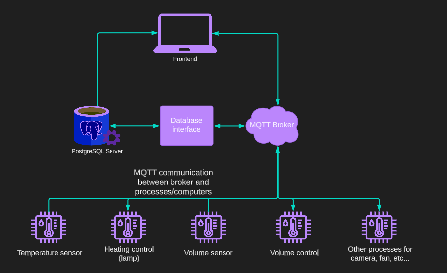
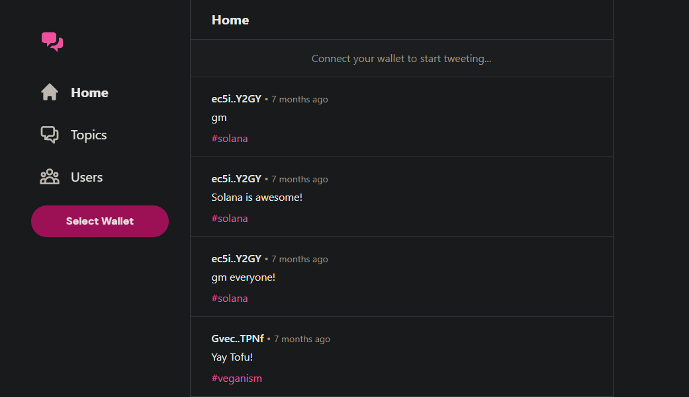

## Competitive Cluster Neural Network - Biomarker Pattern Detection
Unsupervised deep neural networks to learn and detect liquidity patterns through the use of a competitive clustering architecture. In this design written in both Rust and Python, input stimuli activate specific neurons in the initial layer of the network. The outputs from these activated neurons are subsequently amplified and directed to clusters of nodes in the second layer and higher layers within a hierarchical structure. In each cluster, only a single node is allowed to "fire." To achieve this, nodes within the same cluster are interconnected through inhibitory weights, limiting simultaneous activation. As the network is exposed to successive input patterns, it develops distinct "firing patterns" associated with each input. When presented with new input data, the network is expected to display similar firing patterns for inputs that closely resemble previously observed patterns. The network can be used to detect patterns in unclassified data.
- 
- Tags: 1
- Badges:
  - Badge [blue]
- Buttons:
  - Link [https://github.com/robertkottelin/Competitive-cluster-neural-network]

## Environment Monitor with Controllers (designed for a microscope)
Full stack software application that can monitor and manage environmental data such as temperature, humidity, and other metrics using a Raspberry Pi microcomputer and a PostgreSQL database. The application is be accessible via a web page or desktop application, using a Javascript/React user interface and an API and message brokers for data exchange between the front-end and the back-end. Hooked up to temperature controllers, this solution can effectively monitor and control environment variables such as temperature. 
- 
- Tags: 2
- Badges:
  - Badge [blue]
- Buttons:
  - Link [https://github.com/robertkottelin/environment-monitor]

## Decentralized Social Network
A decentralized social network built on the Solana blockchain with Rust and Javascript and is accessed though a web interface. The Solana blockchain serves as the backbone for the platform, and allows for secure, decentralized data storage and sharing of user data and content.
- 
- Tags: 3
- Badges:
  - Badge [blue]
- Buttons:
  - Link [https://github.com/robertkottelin/solana-social-network-v2]